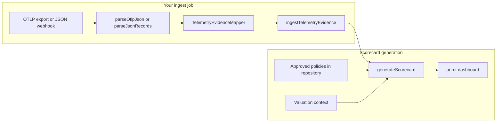

# Telemetry adapters — developer implementation guide

Use this guide when your product **already records telemetry** (OpenTelemetry, Langfuse, Datadog,
PostHog, a custom log pipeline) and you want that data to power the same CFO dashboard as native
SDK instrumentation.

Adapters translate external spans or log records into the **evidence schema**. They do **not**
replace approved policy baselines or hourly valuation. Without those, you get usage charts — not a
CFO scorecard.

**Import paths**

| Language | Path |
| --- | --- |
| TypeScript | `ai-roi-scorecard/adapters` |
| Python | `ai_roi_scorecard.adapters` |

Native `instrumentAsync` / `track_workflow` remain the supported collector for greenfield work.
Adapters are for brownfield hosts that already have observability in place.

**Status checklist:** [adapters-checklist.md](adapters-checklist.md) — what is done, what works via
OTLP export, and what is waiting.

---

## Fastest path — OTLP in one call

If your tool exports OpenTelemetry JSON (Langfuse, Datadog, Honeycomb, LangSmith, or a
collector), use `ingestOtlpJson`:

```ts
import { ingestOtlpJson } from "ai-roi-scorecard/adapters";

const { spans, mapped, appended, skipped } = await ingestOtlpJson(
  repository,
  otlpPayload,
  { accountId: "fallback-account" },
);
```

Tag spans with `roi.workflow_key`, `roi.policy_key`, and `roi.outcome_id`. Then call
`generateScorecard` as usual. See the [status checklist](adapters-checklist.md) for per-vendor
compatibility.

---

## Before you start — checklist

You need four things from **your** application. The adapter only supplies the first.

| # | What | Who provides it | Example |
| --- | --- | --- | --- |
| 1 | **Evidence events** | Adapter (`parse*` → `TelemetryEvidenceMapper` → `ingest*`) | `attempt_started`, `attempt_finished`, `outcome_completed` |
| 2 | **Value policies** | Your admin / governance flow | `ticket-triage` = 45 manual minutes per unit |
| 3 | **Valuation context** | Your contract / finance config | `hourlyValueMinor: "10000"` (=$100/hr) |
| 4 | **Business outcome rule** | Your mapping logic | Span with `roi.outcome_id` = one completed ticket |

If you skip (2) or (3), `generateScorecard` cannot produce dollars. If you skip (4), you get
runtime without valued outcomes.

---

## End-to-end flow



**Your job as a host developer:**

1. Receive telemetry (collector export, webhook, cron batch — **outside** this SDK).
2. Parse → map → ingest into your evidence repository.
3. Store policies and valuation separately (same repository or your own tables).
4. On a schedule or after each batch, call `generateScorecard` and push the snapshot to the dashboard.

The SDK does not poll Langfuse, run HTTP servers, or hold API keys.

---

## Step 1 — Choose a parser

| Your source | Parser | Input shape |
| --- | --- | --- |
| OpenTelemetry collector JSON export, Langfuse/Datadog/Honeycomb/LangSmith OTel export | `parseOtlpJson` | `{ "resourceSpans": [ ... ] }` |
| PostHog, Segment, custom webhook, any JSON log | `parseJsonRecords` | `[{ id, name, startedAt, endedAt?, status?, attributes? }]` |

Langfuse/Datadog/PostHog **native** JSON formats are not shipped yet. Export as OTLP JSON or map
your payload to `parseJsonRecords` yourself.

---

## Step 2 — Tag spans or configure a mapper

### Path A — Semantic tags (recommended)

If your observability tool lets you set custom span attributes, tag **once** at the point work
completes:

| Span attribute | Maps to evidence field | Required? |
| --- | --- | --- |
| `roi.account_id` | `accountId` | Yes (or pass `accountId` in mapper config) |
| `roi.workflow_key` | `workflowKey` | Yes |
| `roi.policy_key` | `policyKey` | Yes |
| `roi.outcome_id` | `outcomeId` | Yes, to value a completed unit |
| `roi.units` | `units` | No (default `1`) |

**Example OTLP span** (see `fixtures/golden-otlp.input.json`):

```json
{
  "traceId": "trace-triage",
  "spanId": "span-triage",
  "name": "support-triage",
  "startTimeUnixNano": "1787392800000000000",
  "endTimeUnixNano": "1787392801200000000",
  "status": { "code": 1 },
  "attributes": [
    { "key": "roi.account_id", "value": { "stringValue": "demo-account" } },
    { "key": "roi.workflow_key", "value": { "stringValue": "ticket-triage" } },
    { "key": "roi.policy_key", "value": { "stringValue": "ticket-triage" } },
    { "key": "roi.outcome_id", "value": { "stringValue": "ticket-42" } }
  ]
}
```

Mapper config is minimal:

```ts
const mapper = new TelemetryEvidenceMapper({ accountId: "fallback-account" });
```

`roi.account_id` on the span wins over the fallback.

### Path B — Mapping config (when you cannot retag)

Map span names or existing attributes in code:

```ts
const SPAN_TO_WORKFLOW: Record<string, string> = {
  "support-triage": "ticket-triage",
  "reply-draft": "reply-draft",
};

const mapper = new TelemetryEvidenceMapper({
  accountId: "team-42",
  workflowKey: (span) => SPAN_TO_WORKFLOW[span.name],
  policyKey: (span) => SPAN_TO_WORKFLOW[span.name],
  outcomeId: (span) => String(span.attributes["ticket.id"] ?? ""),
  recordOutcome: (span) =>
    span.status === "ok" && span.attributes["ticket.id"] !== undefined,
  durationMode: "span",
});
```

**Rules**

- Resolver returns `undefined` → span is **dropped** (no evidence emitted).
- `recordOutcome` defaults to: succeeded span **and** `roi.outcome_id` (or `outcomeId` resolver) is set.
- Override `recordOutcome` when your outcome rule is more complex.

---

## Step 3 — Parse, map, and ingest

### TypeScript (full example)

```ts
import { generateScorecard } from "ai-roi-scorecard";
import {
  TelemetryEvidenceMapper,
  ingestTelemetryEvidence,
  parseOtlpJson,
} from "ai-roi-scorecard/adapters";
import { SqliteScorecardRepository } from "ai-roi-scorecard/storage/sqlite";

// 1. Open your evidence ledger
const repository = new SqliteScorecardRepository("./scorecards.sqlite");
await repository.migrate();

// 2. Load telemetry from your pipeline (file, S3, webhook body, etc.)
const otlpPayload = await loadOtlpExportFromYourPipeline();

// 3. Parse → map → ingest
const spans = parseOtlpJson(otlpPayload);
const mapper = new TelemetryEvidenceMapper({ accountId: "fallback-account" });
const events = mapper.mapSpans(spans);
const { appended, skipped } = await ingestTelemetryEvidence(repository, events);
console.log(`Appended ${appended.length}, skipped ${skipped} duplicates`);

// 4. Ensure policies exist (do this once per approved baseline version)
await repository.putPolicy({
  policyKey: "ticket-triage",
  version: 1,
  scope: "default",
  label: { default: "Support ticket triage", translations: {} },
  manualMinutesPerUnit: 45,
  evidenceLevel: "approved_baseline",
  effectiveFrom: "2026-01-01T00:00:00.000Z",
});

// 5. Generate the CFO snapshot
const snapshot = generateScorecard({
  accountId: "demo-account",
  period: { start: "2026-08-21T00:00:00.000Z", end: "2026-08-28T00:00:00.000Z" },
  generatedAt: new Date().toISOString(),
  events: await repository.getEvents("demo-account"),
  policies: await repository.getPolicies("demo-account"),
  valuation: {
    currency: "USD",
    hourlyValueMinor: "10000",
    serviceCostMinor: "25000",
  },
});

// 6. Push to dashboard (see docs/dashboard.md)
dashboardElement.snapshot = snapshot;
```

### Python (full example)

```python
from ai_roi_scorecard import SqliteScorecardRepository, generate_scorecard
from ai_roi_scorecard.adapters import (
    TelemetryEvidenceMapper,
    TelemetryMapping,
    ingest_telemetry_evidence,
    parse_otlp_json,
)

repository = SqliteScorecardRepository("./scorecards.sqlite")
repository.migrate()

otlp_payload = load_otlp_export_from_your_pipeline()
spans = parse_otlp_json(otlp_payload)
mapper = TelemetryEvidenceMapper(TelemetryMapping(account_id="fallback-account"))
events = mapper.map_spans(spans)
result = ingest_telemetry_evidence(repository, events)

repository.put_policy({
    "policyKey": "ticket-triage",
    "version": 1,
    "scope": "default",
    "label": {"default": "Support ticket triage", "translations": {}},
    "manualMinutesPerUnit": 45,
    "evidenceLevel": "approved_baseline",
    "effectiveFrom": "2026-01-01T00:00:00.000Z",
})

snapshot = generate_scorecard({
    "accountId": "demo-account",
    "period": {
        "start": "2026-08-21T00:00:00.000Z",
        "end": "2026-08-28T00:00:00.000Z",
    },
    "generatedAt": "2026-08-28T08:00:00.000Z",
    "events": repository.get_events("demo-account"),
    "policies": repository.get_policies("demo-account"),
    "valuation": {
        "currency": "USD",
        "hourlyValueMinor": "10000",
        "serviceCostMinor": "25000",
    },
})
```

### Generic JSON records (PostHog, webhooks)

```ts
import { parseJsonRecords } from "ai-roi-scorecard/adapters";

const spans = parseJsonRecords([
  {
    id: "evt-001",
    traceId: "trace-abc",
    name: "ticket_triaged",
    startedAt: "2026-08-22T10:00:00.000Z",
    endedAt: "2026-08-22T10:00:01.200Z",
    status: "ok",
    attributes: {
      "roi.workflow_key": "ticket-triage",
      "roi.policy_key": "ticket-triage",
      "roi.outcome_id": "ticket-99",
    },
  },
]);
```

---

## What one span becomes

For a **successful** span with outcome tagging:

| Order | Evidence event | `eventId` pattern | Notes |
| --- | --- | --- | --- |
| 1 | `attempt_started` | `{spanId}:started` | `occurredAt` = span start |
| 2 | `attempt_finished` | `{spanId}:finished` | `status: succeeded`, `activeDurationMs` from span |
| 3 | `outcome_completed` | `{spanId}:outcome` | Only when outcome rule passes |

For a **failed** span:

| Order | Evidence event | Notes |
| --- | --- | --- |
| 1 | `attempt_started` | |
| 2 | `attempt_finished` | `status: failed` |
| 3 | `exception_recorded` | Category from `exception.category` attribute or `"TelemetryError"` |

**Id mapping**

| Telemetry | Evidence |
| --- | --- |
| `traceId` | `runId` |
| `spanId` / record `id` | `attemptId` |
| Composite suffix | `eventId` (one span → multiple events) |

---

## Step 4 — Policies and valuation (you must implement)

Adapters never guess money or manual time. Store these in your repository before generating a
report.

**Policy** — how long a human used to take per successful unit:

```ts
await repository.putPolicy({
  policyKey: "ticket-triage",      // must match roi.policy_key / mapper policyKey
  version: 1,
  scope: "default",                // or "account" with accountId
  label: { default: "Support ticket triage", translations: {} },
  manualMinutesPerUnit: 45,
  evidenceLevel: "approved_baseline",
  effectiveFrom: "2026-01-01T00:00:00.000Z",
});
```

**Valuation** — what an hour is worth for this customer/period:

```ts
const valuation = {
  currency: "USD",
  hourlyValueMinor: "10000",   // $100.00/hr in cents
  serviceCostMinor: "25000",     // optional; enables net value and ROI
};
```

See [Policy approval and governance](policy-governance.md).

---

## Step 5 — Wire the CFO dashboard

Regenerate the open week whenever new evidence is ingested:

```ts
import { generateScorecard } from "ai-roi-scorecard";

const snapshot = generateScorecard({
  accountId,
  period: openWeekPeriod,
  generatedAt: new Date().toISOString(),
  events: await repository.getEvents(accountId, { throughSequence: watermark }),
  policies: await repository.getPolicies(accountId),
  valuation: approvedValuation,
});

document.querySelector("ai-roi-dashboard").snapshot = snapshot;
```

Full embed details: [Embeddable CFO dashboard](dashboard.md).

**Hours saved** appears only when measured runtime exists (`runtimeMeasurement === "measured"`).
That requires `attempt_finished` events with trustworthy `activeDurationMs`.

---

## Replay and idempotency

`ingestTelemetryEvidence` skips events whose `eventId` already exists in the ledger. Safe to
re-run the same export file or webhook delivery.

Composite ids prevent collisions when one span produces multiple events:

```
span-abc:started
span-abc:finished
span-abc:outcome
span-abc:exception   (failures only)
```

If you change mapping logic, **do not** reuse span ids for different semantics — use
`correction_appended` events (native evidence path) or a new span id.

---

## Safety rules (required)

The adapter strips common PII keys (`prompt`, `completion`, `input`, `output`, `email`, etc.).
You must still ensure your pipeline never relies on copying raw LLM content into evidence.

| Do | Don't |
| --- | --- |
| Map active worker duration | Map queue wait or provider round-trip as "AI time" |
| Use allowlisted exception categories | Copy stack traces or error messages |
| Tag stable business ids (`ticket-42`) as `outcome_id` | Treat HTTP 200 or "LLM finished" as a valued outcome |
| Drop spans with unknown duration (`durationMode: "span"`) | Report `activeDurationMs: 0` to fake measurement |

**Duration modes**

| `durationMode` | Behavior |
| --- | --- |
| `"span"` (default) | Requires computable duration; span dropped if missing |
| `"omit"` | Emits `attempt_finished` with `activeDurationMs: 0`; use only when you accept unmeasured runtime |

---

## Troubleshooting

| Symptom | Likely cause | Fix |
| --- | --- | --- |
| No events after ingest | Span missing `workflowKey` / `policyKey` | Add `roi.*` tags or fix resolvers |
| `generateScorecard` status `needs_attention` | Outcome without successful `attempt_finished` | Check span status and duration |
| `send_not_recommended` | No `outcome_completed` events in period | Add `roi.outcome_id` or `recordOutcome` |
| Dollars are zero | Missing policy or wrong `policyKey` | `putPolicy` with matching key |
| Hours saved not shown | No measured runtime | Ensure `endTimeUnixNano` present; use `durationMode: "span"` |
| Duplicate value on replay | Bypassing `ingestTelemetryEvidence` | Always ingest through helper |
| Prompts in your DB | Custom attributes bypassing sanitizer | Do not map raw LLM fields |

---

## Go-live checklist

- [ ] Outcome spans tagged with `roi.workflow_key`, `roi.policy_key`, `roi.outcome_id`
- [ ] Policies stored with matching `policyKey` and effective dates
- [ ] Valuation approved for the reporting period
- [ ] Ingest job calls `ingestTelemetryEvidence` (not raw `append` without dedup)
- [ ] Dashboard refresh calls `generateScorecard` with current watermark
- [ ] Sealed weeks load stored snapshots; open weeks regenerate
- [ ] PII/prompt attributes never copied into evidence

---

## Runnable example

After `pnpm build`:

```bash
node examples/adapters/otel-batch.mjs
```

Parses `fixtures/golden-otlp.input.json`, ingests with replay skip, and prints scorecard totals.

---

## API reference

| TypeScript | Python | Purpose |
| --- | --- | --- |
| `parseOtlpJson` | `parse_otlp_json` | OTLP JSON → `NormalizedTelemetrySpan[]` |
| `parseJsonRecords` | `parse_json_records` | Generic JSON records → spans |
| `TelemetryEvidenceMapper` | `TelemetryEvidenceMapper` | Spans → `EvidenceEvent[]` |
| `ingestTelemetryEvidence` | `ingest_telemetry_evidence` | Deduping append to repository |
| `ROI_SEMANTIC_ATTRIBUTES` | `ROI_SEMANTIC_ATTRIBUTES` | Canonical `roi.*` key names |
| `sanitizeAttributes` | `sanitize_attributes` | Strip PII-like attribute keys |

Full API map: [api.md](api.md).

---

## Out of scope (v1)

- Vendor REST clients (Langfuse API, Datadog API, PostHog API)
- Webhook servers or authentication inside the SDK
- Token counts or HTTP status codes as dollars saved
- New calculation or schema changes

Native proprietary parsers can be added later using the same `NormalizedTelemetrySpan` shape.

## Replay and unmeasured runtime in 0.2.0

Both timestamps are required for mapped completed work, even in `omit` mode. Omitted duration
stays absent; explicit zero is measured. Units must be positive integers no larger than
1,000,000,000. Built-in SQLite and PostgreSQL use atomic `appendIfAbsent` / `append_if_absent`:
identical replay skips, conflicting IDs roll back the batch. Custom repositories with only
strict `append` retain a single-writer fallback. See [the CLI walkthrough](cli.md).
